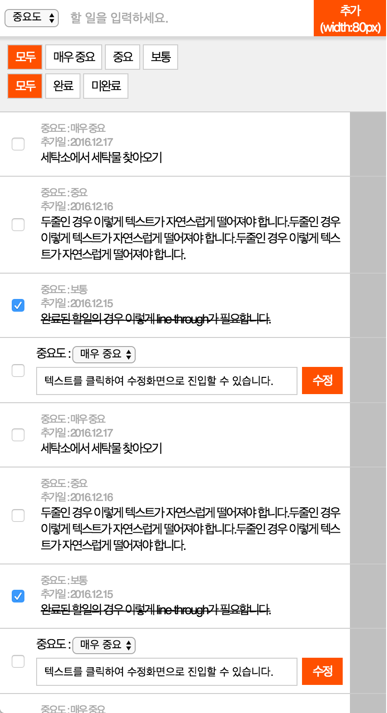
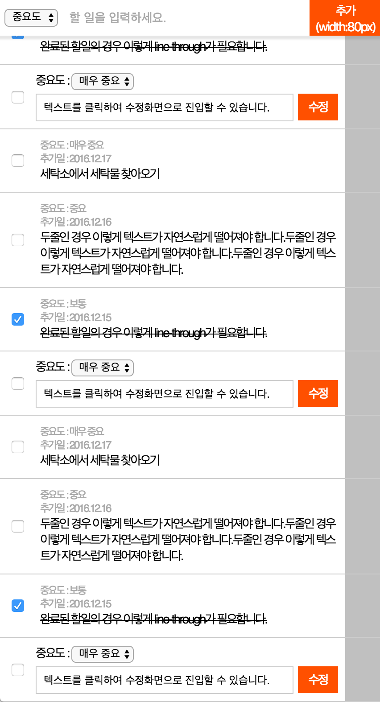

## cra 없이 React Todo List 만들기

### 아래 이미지는 To Do List 를 관리하는 모바일웹 어플리케이션을 캡쳐한 화면입니다.

### 이미지를 참고하여, 같은 어플리케이션을 answer.html 에 개발하여 제출하시면 됩니다.

### 구현에 있어서는 아래 스펙을 만족하여야 합니다.

### 기본규칙

- 그림 1의 리스트는 To do list 입니다. 좌측의 체크박스는 완료버튼이며, 완료시 To do 가 완료되었다는 의미로 텍스트에 line through 가 생겨야 합니다.
- 그림 1의 상단, '할일을 추가하세요' 는 input 영역이며, 텍스트 입력 후 추가시 하단 리스트에 항목이 추가됩니다.
- 그림 2과 같이, 스크롤을 내렸을때 상단 input 영역은 상단에 고정된 상태로 유지되어야 합니다.

### 마크업

- To do list 화면을 마크업합니다. css3 를 사용하셔도 좋으며, 다양한 디바이스 크기를 만족하여야 합니다.
- 상단 중요도 선택 select box 는 화면의 사이즈와 상관없이 항상 width:60px 이어야 합니다.
- 상단 '추가' 버튼은 화면의 사이즈와 상관없이 항상 width:80px; height:40px 이어야 합니다.
- 상단 할일입력 input 필드의 width 는 중요도와 추가 버튼을 제외한 나머지 영역이어야 합니다. (예: 창 크기가 400px 인 경우 중요도가 60px 이고 추가버튼이 80px이므로 input 은 260px 이어야 합니다)
- 리스트 좌측 체크박스와, 우측 회색 영역 (드래그앤 드랍) 은 각각 width가 항상 40px 이어야 합니다.

### Javascript

- 추가영역 하단의 '모두', '매우 중요', '중요', '보통' 영역은 중요도 필터링 버튼입니다. 매우 중요, 중요, 보통은 복수로 선택될 수 있으며 선택된 할일 목록만 화면에 노출되고, 나머지는 숨겨져야 합니다. 모두를 활성화할 경우 다른 항목은 비활성화되며, 모든 할 일이 노출됩니다.
- 추가영역 하단의 '모두', '완료', '미완료' 영역은 완료여부 필터링 버튼입니다. 완료, 미완료는 복수로 선택될 수 있으며 선택된 할일 목록만 화면에 노출되고, 나머지는 숨겨져야 합니다. 모두를 활성화할 경우 다른 항목은 비활성화되며, 모든 할 일이 노출됩니다.

### [추가항목]

이미 추가된 할일항목 (예 : 세탁소에서 빨래 찾아오기) 을 터치하면 input 으로 변경되면서, 내용을 수정할 수 있어야 합니다. (수정하는 경우 추가일은 오늘 날짜로 변경됩니다.)
할 일 추가 input 이 비어있는 상태에서 추가버튼을 누르면 입력되지 않아야 합니다.
드래그 앤 드랍 (회색 영역을 터치했을 때만 동작) 으로 할 일의 순서를 바꿀 수 있어야 합니다.

<그림1>

<그림2>

<그림3>
